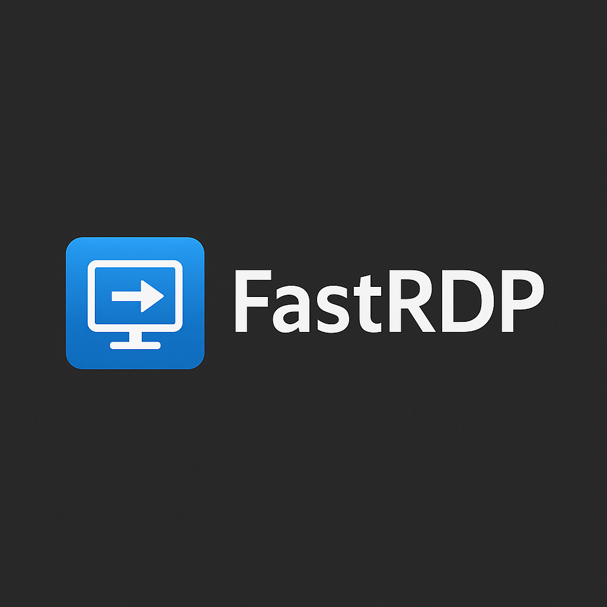

# 🚀 FastRDP - RDP Bağlantı Yöneticisi

Modern ve hızlı bir RDP (Remote Desktop Protocol) bağlantı yönetim uygulaması. WinUI 3 ile geliştirilmiş, Fluent Design prensiplerini benimseyen masaüstü uygulaması.

<p align="center">
  
</p>

## ✨ Özellikler

### Temel Özellikler
- ✅ **RDP Profil Yönetimi**: Tüm RDP bağlantılarınızı tek yerden yönetin
- 🔍 **Gelişmiş Arama**: İsim, host, etiket bazlı hızlı arama
- ⭐ **Favoriler**: Sık kullandığınız bağlantıları favorilere ekleyin
- 🕒 **Son Kullanılanlar**: En son bağlandığınız sunucular
- 📝 **Profil Düzenleme**: Kolay ve kullanışlı profil oluşturma/düzenleme
- 🏷️ **Etiketleme**: Profillerinizi kategorize edin
- 📁 **Gruplama**: Profilleri gruplar halinde düzenleyin

### Kullanıcı Deneyimi
- 🎨 **Tema Desteği**: Light ve Dark tema
- 🖱️ **Sağ Tık Menüsü**: Hızlı erişim için context menu
- 📂 **Dosya Yönetimi**: RDP klasörüne doğrudan erişim
- 💾 **Otomatik Yedekleme**: Profillerinizin güvenliği

### Gelişmiş Özellikler
- 📌 **Jump List Entegrasyonu**: Taskbar'dan hızlı erişim
- 🔗 **Çift Tıkla Bağlan**: Hızlı bağlantı kurma
- 🖥️ **Çoklu Monitör Desteği**: Birden fazla monitörde RDP oturumu açma
- 📊 **İstatistikler**: Toplam profil sayısı ve kullanım bilgileri
- 🔒 **Güvenli**: Şifreler Windows DPAPI ile korunur (opsiyonel)

## 🛠️ Teknolojiler

- **Framework**: .NET 8.0
- **UI Framework**: WinUI 3 (Windows App SDK)
- **Architecture**: MVVM Pattern
- **Dil**: C# 12

## 📋 Gereksinimler

- Windows 10 version 1809 (Build 17763) veya üzeri
- .NET 8.0 Runtime
- Windows App SDK 1.5 veya üzeri

## 🚀 Kurulum

### Geliştirici Kurulumu

1. **Gerekli araçları yükleyin:**
   - Visual Studio 2022 (v17.8 veya üzeri)
   - .NET 8.0 SDK
   - Windows App SDK workload

2. **Projeyi klonlayın:**
   ```bash
   git clone https://github.com/mcicekci/Fast.RDP.git
   cd Fast.RDP
   ```

3. **Projeyi açın:**
   ```bash
   start FastRDP.sln
   ```

4. **NuGet paketlerini restore edin:**
   Visual Studio otomatik olarak restore edecektir veya:
   ```bash
   dotnet restore
   ```

5. **Projeyi derleyin ve çalıştırın:**
   ```bash
   dotnet build
   dotnet run
   ```

### Son Kullanıcı Kurulumu

1. [Releases](https://github.com/mcicekci/Fast.RDP/releases) sayfasından son sürümü indirin
2. `FastRDP_Setup.exe` dosyasını çalıştırın
3. Kurulum sihirbazını takip edin
4. Uygulamayı başlatın ve ilk profilinizi oluşturun

## 📖 Kullanım

### İlk Çalıştırma

1. Uygulama ilk çalıştırıldığında `Data/profiles` klasörü otomatik oluşturulur
2. Mevcut RDP dosyalarınız varsa, onları bu klasöre kopyalayabilirsiniz
3. "Yeni Profil" butonuna tıklayarak yeni bir RDP bağlantısı ekleyin

### Profil Oluşturma

1. Sol panelde **"Yeni Profil"** butonuna tıklayın
2. Gerekli bilgileri doldurun:
   - **Bağlantı Adı** (zorunlu)
   - **Host/IP Adresi** (zorunlu)
   - Kullanıcı Adı (opsiyonel)
   - Domain (opsiyonel)
   - Grup (varsayılan: "Genel")
   - Çözünürlük ayarı (Auto, Fullscreen, 1920x1080, vb.)
   - Çoklu monitör seçenekleri:
     - Çoklu monitör kullan
     - Tüm monitörleri kullan (fullscreen)
   - Etiketler
   - Notlar
   - Favorilere ekle
3. **"Kaydet"** butonuna tıklayın

### Bağlantı Kurma

**Yöntem 1**: Profili çift tıklayın  
**Yöntem 2**: Profili seçin ve sağ panelden "Bağlan" butonuna tıklayın  
**Yöntem 3**: Sağ tıklayıp "Bağlan" seçeneğini seçin  
**Yöntem 4**: Taskbar'dan Jump List'i kullanın

### Arama ve Filtreleme

- **Arama Kutusu**: Üst bardaki arama kutusunu kullanarak isim, host, grup veya etiket ile arayın
- **Filtreler**: Sol panelden filtreleri kullanın:
  - Tümü
  - Favoriler
  - Son Kullanılanlar
  - Gruplara göre filtreleme

## 🗂️ Proje Yapısı

```
FastRDP/
│
├── Models/                      # Veri modelleri
│   ├── RdpProfile.cs
│   └── AppSettings.cs
│
├── Services/                    # İş mantığı katmanı
│   ├── RdpFileService.cs       # RDP dosya işlemleri
│   ├── SettingsService.cs      # Ayar yönetimi
│   └── JumpListService.cs      # Jump List entegrasyonu
│
├── ViewModels/                  # MVVM ViewModels
│   ├── BaseViewModel.cs
│   ├── MainViewModel.cs
│   └── ProfileEditorViewModel.cs
│
├── Views/                       # Kullanıcı arayüzü
│   ├── ProfileListView.xaml
│   └── ProfileEditorView.xaml
│
├── Assets/                      # Görseller ve ikonlar
│   └── Icons/
│
├── Data/                        # Uygulama verileri
│   ├── settings.json
│   └── profiles/               # RDP dosyaları
│
├── MainWindow.xaml             # Ana pencere
├── App.xaml                    # Uygulama giriş noktası
└── Package.appxmanifest        # Uygulama manifestosu
```

## 🎨 Tasarım Prensipleri

### Renk Paleti

- **Arka Plan (Dark)**: `#1E1E1E`
- **Ana Vurgu**: `#0078D4` (Windows Mavi)
- **Başarı**: `#107C10` (Yeşil)
- **Uyarı**: `#FFB900` (Sarı)
- **Hata**: `#D13438` (Kırmızı)

### Tipografi

- **Ana Font**: Segoe UI Variable
- **İkonlar**: Segoe Fluent Icons

## 🔐 Güvenlik

- RDP şifreleri varsayılan olarak dosyada saklanmaz
- Windows Credential Manager entegrasyonu (gelecek sürümler için planlandı)
- DPAPI ile şifre koruması desteği (opsiyonel)

## 📊 Veri Depolama

### settings.json
```json
{
  "rdpFolder": "Data/profiles",
  "theme": "dark",
  "showThumbnails": false,
  "recentCount": 10,
  "startWithWindows": false,
  "minimizeToTray": true,
  "lastBackup": "2025-10-22T12:00:00",
  "autoBackup": true
}
```

### profiles.json
```json
[
  {
    "id": "unique-guid",
    "name": "ERP Sunucusu",
    "file": "erp.rdp",
    "host": "192.168.1.100",
    "username": "admin",
    "domain": "COMPANY",
    "group": "Üretim",
    "resolution": "1920x1080",
    "useMultiMonitor": false,
    "useAllMonitors": false,
    "notes": "Ana ERP sunucusu",
    "tags": ["ERP", "Finans"],
    "lastUsed": "2025-10-22T12:35:00",
    "favorite": true,
    "createdAt": "2025-10-20T10:00:00"
  }
]
```

## 🛣️ Yol Haritası

### Sprint 1: Temel İşlevsellik ✅
- [x] Proje yapısı
- [x] Model ve Service katmanları
- [x] ViewModel implementasyonu
- [x] Temel UI

### Sprint 2: Kullanıcı Deneyimi ✅
- [x] Tema değiştirme animasyonları
- [x] Drag & Drop ile RDP import
- [x] Gelişmiş profil kartları (thumbnail önizleme)
- [🚧] Ayarlar penceresi (temel dialog hazır)

### Sprint 3: Gelişmiş Özellikler ✅
- [x] Jump List tam entegrasyonu
- [x] Sistem tepsisi desteği
- [x] Çoklu monitör desteği
- [ ] Widget görünümü

### Sprint 4: Test ve Dağıtım (Planlanan)
- [ ] Birim testleri
- [ ] UI testleri
- [ ] MSIX paketleme
- [ ] Microsoft Store yayını

## 🤝 Katkıda Bulunma

Katkılarınızı bekliyoruz! Lütfen aşağıdaki adımları takip edin:

1. Projeyi fork edin
2. Feature branch oluşturun (`git checkout -b feature/AmazingFeature`)
3. Değişikliklerinizi commit edin (`git commit -m 'Add some AmazingFeature'`)
4. Branch'inizi push edin (`git push origin feature/AmazingFeature`)
5. Pull Request açın

### Kod Standartları

- Clean Code prensiplerini takip edin
- MVVM pattern'e uyun
- XML dokümantasyonu ekleyin
- Türkçe yorum ve değişken isimleri kullanabilirsiniz

## 📝 Lisans

Bu proje MIT lisansı altında lisanslanmıştır. Detaylar için [LICENSE](LICENSE) dosyasına bakın.

## 👥 Geliştirici

**FastRDP Team**
- GitHub: [mcicekci/Fast.RDP](https://github.com/mcicekci/Fast.RDP)

## 🙏 Teşekkürler

- Microsoft WinUI Team
- Windows App SDK Contributors
- Tüm katkıda bulunanlar

## 📞 İletişim

Sorularınız veya önerileriniz için:
- Issue açın: [GitHub Issues](https://github.com/mcicekci/Fast.RDP/issues)

## ⚠️ Feragatname

Bu uygulama bağımsız bir açık kaynak projedir ve Microsoft Corporation ile bağlantılı değildir.

---

**⭐ Projeyi beğendiyseniz yıldız vermeyi unutmayın!**

